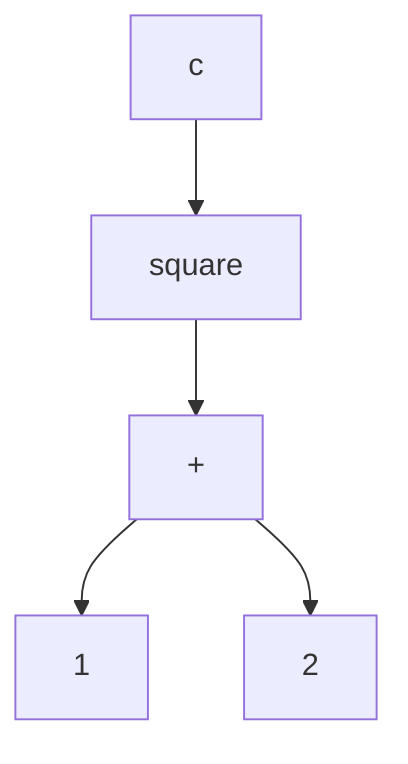
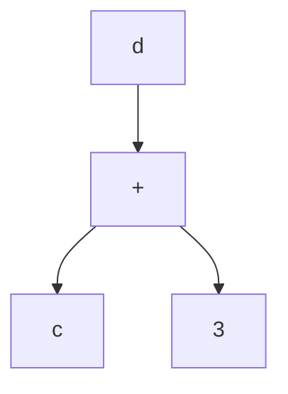
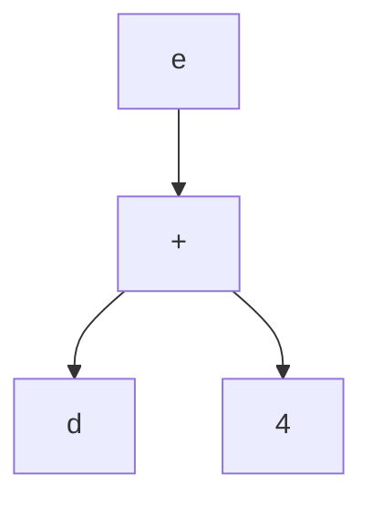

{: .note }
Heya! Matt here. This lecture note covers Scoping and Binding from [Data Palooza](https://docs.google.com/presentation/d/18FaEpHZgssxTS-TNSs-VJDghLS1v5X1N/). We continue from [last week]({{site.baseurl}}/lectures/08) where we wrapped up conversions and casts.

## Table of Contents
{: .no_toc }

{:toc}
- dummy item

## Scoping

### Motivation and Definitions

#### Scope and In Scope

The **scope** of a variable is the part of a program where a variable is valid (i.e., can be accessed). The parts can be lines, statements, expressions, instructions, or other units!

A variable is **"in scope"** in a part of a program if it is *currently* accessible by name.

For this example,

```cpp
void foo() {
  int x;
  cout << x;
}
```

we'd say:

- "The scope of the `x` variable is the function `foo()`."
- "The x variable is in scope within the `foo` function because it is defined at the top of the function."

**Scoping strategies** describe when variables are in-scope!

Here's a simple example from C++:

```cpp
void foo() {
  int x;
  cout << x; // Just fine, x is in foo’s scope!
}

void bar() {
  cout << x; // ERROR! x isn’t in bar’s scope!
}
```

C++ uses a lexical scoping strategy that scopes to blocks (we'll explain this soon).

#### Lexical Environments

Here's a slightly more in-depth example:

```cpp
string dinner = "burgers";     // this variable's scope is global - it's in scope everywhere

void party(int drinks) {       // drinks is in scope for the entire party() function
  cout << "Partay! w00t";
  if (drinks > 2) {
    bool puke = true;          // bool is only in scope for this if statement
    cout << "Puked " << dinner;
  }
}

void study(int hrs) {          // hrs is in scope for the entire study() function; but, not the same hrs as main()!
  int drinks = 2;              // drinks is also in scope for study(); but, not the same drinks as party()!
  cout << "Study for " << hrs;
  party(drinks+1);
}

int main() {
  int hrs = 10;                // this hrs is only in scope in main(); different from the hrs in study()!
  study(hrs-1);
}
```

Functions have their own scope too: they are defined immediately after they're declared.

As the program runs, it maintains a **lexical environment**: a tracker of what's in scope and what's not!

- for example, in the `main()` function, the lexical environment only contains the variable `hrs` and the three functions `main()`, `study()`, and `party()`
- but, once we call `study(hrs-1)` and enter a new environment, the lexical environment changes: we get a different `hrs` (the one in the argument), as well as a new variable `drinks`
- for a full trace, play through the animations on slide 83!

Many languages have *slightly different* scoping strategies! Differences include:

- how do constructs like functions, control flow (if statements, loops), or classes affect varaible scope?
- what do you do if you try to define a new variable with a name that already exists?
- when does a variable's scope end?

By the end of this section, we'll know how to answer these questions for all sorts of functions :)

#### Lifetime

There is one related but different concept: a lifetime.

A variable’s **lifetime** describes when a variable can be accessed. It includes times when the variable is in scope, but also times where it's not in scope (but can be accessed indirectly).

Values also have lifetimes. Variables and the values they point to can have different lifetimes!

Take a look at our previous example, but slightly modified:

```cpp
void study(int how_long) {
  while (how_long-- > 0)
    cout << "Study!\n";
  cout << "Partay!\n";
}

int main() {
  int hrs = 10;
  study(hrs);
  cout << "I studied " << hrs <<
        " hours!";
}
```

The scope of `hrs` is only within `main()`; when we call into `study`, we can no longer access it. But, **its lifetime also extends to `study()`**, since we can access it indirectly - through the variable `how_long`!

Python lets you manually end a variable's lifetime early:

```py
def main():
  var = "I exist"
    ...
  del var    # no longer exists!
  print(var) # error!
```

### Lexical Scoping

Lexical scoping is the most-used scoping paradigm (almost all languages you've used use it). The core tenet has to do with how your code is organized, which we'll call the **context** that a variable is defined in. If we can't find the variable in the current context, we'll go to the enclosing context - until we run out (and hit the global context).

More strictly, languages like Python use the **LEGB** rule. We look for a variable in this order:

1. First, look at the **local scope**. In Python, this is either an expression or a function.
2. If it's not there, look at successive **enclosing scopes**. Repeat this until...
3. You hit the **global scope**.
4. If it's still not there, look at the **built-in scope** - this contains things like `print`

Importantly, once a context is over, the variables in that context can't be accessed!

To get a feel of lexical scoping, let's go through a few examples.

In Python, one context type is an **expression**:

```py
sum([x*x for x in range(10)])     # this works :)
sum([x*x for x in range(10)] + x) # x isn't in scope!
```

In this example, `x` is defined in the context of an **expression** (a list comprehension). Its scope is only in that expression!

In C++, one context type is a **block** (roughly: any set of braces, `{` and `}`):

```cpp
if (drinks > 2) {
  int puke = 5;
  // ...
}
cout << puke; // error - puke is not in scope!
```

Note that Python does not scope with respect to blocks!

```py
def a():
  if True:
    x = 5
  print(x) # this works!
```

However, both Python and C++ scope to **functions**:

```py
def a():
  x = 5

print(x) # error - x is out of scope!
```

```cpp
void snore(int n) {
  int i = 0;
  while (i++ < n){ /* */}
}
cout << i; // error - i is not in scope!
```

Other relevant scoping constructs include:

- classes: think about private functions and member variables!
- namespaces: think about `using namespace std;` versus having to type out `std::cout`
- the **global** scope: the last resort!


#### Shadowing

When a variable is redefined in a different context, lexical scoping languages typically use an approach called **shadowing**. In an inner context, the redefined variable "replaces" all uses of the outer context variable; once the inner context is finished, we return to the outer context variable.

Here's a classic example from the [Wikipedia page on shadowing](https://en.wikipedia.org/wiki/Variable_shadowing) for Python:

```py
def outer():
  x = 1
  def inner():
    x = 2
    print("inner:", x)
  inner()
  print("outer:", x)
outer()
print("global:", x)
```

and in C++:

```cpp
int main(){
  int x = 42;
  int sum = 0;

  for (int i = 0; i < 10; i++) {
    int x = i;
    std::cout << "x: " << x << '\n'; // prints values of i from 0 to 9
    sum += x;
  }

  std::cout << "sum: " << sum << '\n';
  std::cout << "x:   " << x   << '\n'; // prints out 42
}
```

Shadowing is not *great* practice (though there are legitimate uses!). However, you'll encounter it frequently when reading code, and *accidentally*! For example, consider this function in Python:

```py
def a(input):  # this shadows the global input!
  print(input)
  a = input()  # this doesn't work anymore!!
```

So, you have to be careful with shadowing!!

### Dynamic Scoping

**Dynamic scoping** takes a different approach: the value of a variable is always the most recently defined (or redefined) version, regardless of the lexical scope! For dynamic scoping, what matters is the **chronological order** variables are defined in: not how the code is structured.

Here's a quick example:

```
func foo() {
  x = x + 1;
  print x
}

func bar() {
  x = 10;
  foo();
}

func main() {
  x = 1;
  foo();
  bar();
}

// prints:
// 2
// 11
```

The interesting note is that `foo()` or `bar()` didn't need arguments or parameters. After defining `x` once, its value "persists" across `foo()`, `bar()`, and the subsequent call to `foo()`! Neat!

{: .note }
This seems to behave like Brewin...

These days, few languages use it. Here's one example from Emacs Lisp:

```lisp
(setq a 100)  ; sets a to 100

; prints the value of a
(defun print_value_of_a ()
  (print a))

; define local variable a, then
; call print_value_of_a
(let ((a -42))
  (print_value_of_a))

; this prints: -42
```

## Variable Binding Semantics

**Variable binding semantics** describe how the name of a variable is related to the memory that stores its value. Turns out, this is *harder than you think*!

We'll cover four approaches:

1. **Value Semantics**: a variable is directly bound to storage that holds the value
2. **Reference Semantics**: a variable is directly bound to another variable's storage that holds the value
3. **Object Reference Semantics**: a variable is bound to a *pointer* that points to storage that holds the object/value
4. **Name Semantics**: a variable is bound to a *pointer* that points to an expression graph that evaluates the value

Unlike other concepts in this class, languages often mix-and-match their approaches! For example, C++:

- uses **value semantics** for primitive data types
- uses **reference semantics** with the reference operator (ex: `int &r = x;`)
- uses **object reference semantics** when explicitly referencing/dereferencing pointers

### Value Semantics

Value semantics is the simplest approach. Each variable name is directly bound to the storage that represents that variable.

In languages like C++ (which uses value semantics for primitive data types), local variables are stored on the stack in an "activation record". You can think of an activation record as a map from variable names to their direct values; the entire record lives in memory.

```cpp
// activation record: nothing!
int main() {
  int x = 5; // activation record: (x,5)
  int y = 0; // activation record: (x,5), (y,0)

  y = x;     // activation record: (x,5), (y,5)
}
// activation record: nothing!
```

When reassignment is done, like in the C++ example above, **the value is completely copied over**. After `y = x`, there is no relationship between `y` and `x` (other than their values being equal). This is distinction may seem obvious, but it's not true for other binding semantics!

{: .note }
Think about how this would work for non-primitive data types. You'd either have to copy over *every* field, which would be expensive, or copy over a pointer - which seems to break the "copying" rule. The former is so expensive that most languages do not implement it by default (colloquially, this is called deep copying).

### Reference Semantics

**Reference semantics** allows you to assign an *alias name* to an existing variable and read/write it through that alias. The reference variable functions identically to the previous variable. Unlike other binding strategies, it's really only relevant when you have *multiple* variables.

Take a look at this C++ example. Recall that in C++, we place an ampersand (`&`) in front of a variable declaration to make it a reference:

```cpp
int main() {
  string role = "SWE";
  string &truth = role; // binds truth to role

  truth = "QA"; // since truth points to the same mem location as role, this updates both!

  cout << "Addr of role: "  << &role << endl;
  cout << "Addr of truth: " << &truth << endl;
}
// both role and truth will have the value "QA"
// the printed addresses will be the same!
```

The key insight is that `&truth` isn't a pointer to the `role` variable; it points to the **same memory location** as `role`! When we update `truth`, we also update `role` (and vice-versa).

Another simple example is in the slides:

```cpp
int main() {
  int x = 5;
  int &r = x;
  r += 1;
  // at this point, *both* x and r have the value 6!
}
```

Under the hood, references are often implemented with pointers - this is how it works in C++!

{: .note }
Philosophically, you could argue that "both" is the wrong word to use - the variable and the reference copy are *the same thing*!

### Object Reference Semantics

**Object reference semantics** binds a variable name a pointer variable that itself points to an object or value. It's both very common and also a little confusing, so we'll spend a good chunk of time on this one!

(unlike reference semantics which hides its use of pointers, with object reference semantics the pointers are explicit and you can read/write them!)

Let's take a look at a Python example first. In Python, small integer literals like `5` and `20` are actually **allocated on the heap**; they aren't created and recreated every time a new variable is made. Instead, the activation record maps variables to pointers to items on the heap.

Let's take a look at what that implies:

```py
def main():
  x = 5     # x points to a 5 on the heap!
  y = 20    # y points to a 20 on the heap!
  y = x     # y is re-pointed to 5 on the heap; no values are copied!
            # instead, the *pointer* value for x is copied to y
            # at this point, the 20 can be garbage collected, since there are no references to it!
  y = y + 1 # y now points to a 6 on the heap;
            # x is unchanged!
```

There are two key behaviours to call out:

- on `y = x`, the **pointer values are copied**, but **not the memory itself**.
- on `y = y + 1`, `x` is unaffected, since we create a new object and change `y`'s pointer; not the underlying object!

Take a look at a more complicated object with fields:

```py
class Nerd:
 def __init__(self,name,iq):
  self.name = name
  self.iq = iq

 def study(self):
  self.iq = self.iq + 50

 def iq(self):
  return self.iq

 def myname(self):
  return self.name

def main():
 n1 = Nerd("Carey", 100) # points to a Carey nerd on the heap
 n2 = Nerd("Paul", 200)  # points to a Paul nerd on the heap
 n2 = n1                 # changes n2 to point to the Carey nerd;
                         # the Paul nerd can be GC'd!
 n1.study()              # changes the Carey nerd's IQ to 150
 print(f"{n2.myname()}'s IQ is {n2.iq()}") # n2 points to the Carey Nerd, so "Carey's IQ is 150"!
```

The confusion here is:

- `n2 = n1` doesn't change *any* underlying objects; it's just a pointer copy
- however, `n1.study()` changes a **field inside an object**.
    - a `150` is put on the heap, and `self.iq` now points to it
    - so, we've changed the field of an object through object reference!

The difference in how object reference semantics treats object assignment (`n2 = n1`) and field access (`n1.study()`) is important!

With this in mind: many languages use object reference semantics. Some use it for everything, like Python - others, like Java, only use it for complex objects (and value semantics for primitives).

#### Equality

With object reference semantics, we need to introduce some better tools that test for equality: two pointers with different values could point to the same block of memory!

- **Object Identity**: Do two object references refer to the same object at the same address in RAM.
- **Object Equality**: Do two object references refer to objects that have equivalent values (even if they're different objects in RAM).

Some languages, like Python, have `==` perform object equality by default. Others, like Java, perform object identity - this is why you shouldn't use `==` to compare strings in Java!


#### C++ Pointers

In C++, pointers explicitly perform object referencing semantics!

- when using `*` and `&` to interact with pointers, we change the underlying values
- without using `*` and `&`, we're instead changing the object references!

```cpp
// C++ pointer example

int main() {
  int x = 5, y = 6;
  int *px = &x; // pointer to the same memory block as x
  int *py = &y; // pointer to the same memory block as y

  *py = *px;    // changes the underlying memory, but not the pointers!
  py = px;      // changes the pointers, but not the underlying memory!
  *py = 42;     // changes the underlying memory, but not the pointers!
}

```

It's helpful to differentiate between the three different binding semantics by the different ways C++ lets you use them!

### Name and Need Semantics

**Name semantics** binds a variable name to a pointer that points to an expression graph called a "thunk".

{: .note }
Here, we mean graph in the computer science sense - nodes connected by edges!

Consider the Haskell expression:

```hs
square x = x*x
c = square (a + b)
```

We can draw the following graph to illustrate how the values are related to each other:


When a variable's value is needed (e.g., to be printed), the expression represented by the graph is "lazily evaluated" and a value is produced.

Languages like Haskell implement a variant of this called **"Need Semantics"** which memoize (cache) the result of each evaluation to eliminate redundant computations.

Here's one example where this memoization can save us computation time:

```hs
square x = x*x
c = square (1 + 2)
d = square (1 + 2) + 3
e = square (1 + 2) + 3 + 4
```

We can note that there are some redundant computations:

- `1 + 2`
- `square (1 + 2)`
- `square (1 + 2) + 3`

When we create an expression graph, there will be **redundant subgraphs**. Here are the compact versions of them (think about why they're equivalent!):








{: .note }
Memoization would only work if expressions return the same thing every time you call them - which is only true if your expressions **have no side effects**, like in Haskell!

{: .note }
If you're curious, Matt recommends [this blog post](https://apfelmus.nfshost.com/articles/lazy-eval-intro.html) for further reading!
